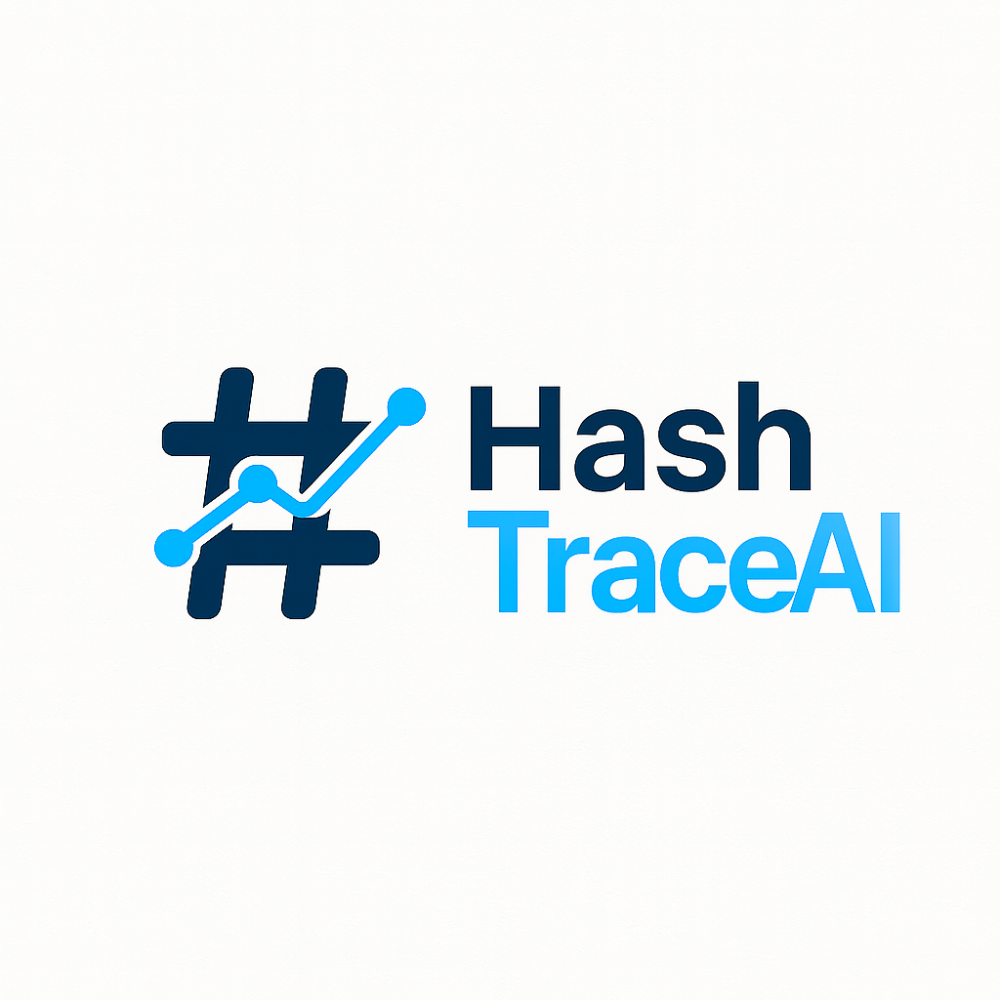

<p align="center">
  
</p>

<p align="right">
  
  
  
  
</p>

# HashTraceAI

HashTraceAI is a lightweight tool for generating and verifying file-level manifests for machine learning models. It calculates cryptographic hashes of files in a model directory, produces a JSON manifest, and verifies those hashes to detect drift, tampering, or unintended changes.

## Purpose

HashTraceAI helps security teams verify the integrity and provenance of machine learning model artifacts in CI/CD pipelines or production deployments. By creating a manifest with cryptographic hashes of each file, teams can quickly detect drift, unauthorized modification, or corruption during storage or transmission.

## Features

- Generates a file-level manifest from any directory or model hub (Hugging Face, MLflow)
- Uses **SHA-256** for secure hashing
- Supports **RSA-signed manifests** for tamper detection and authenticity verification
- Uses **password-encrypted private keys** for secure signing operations
- Verifies model files against a previously generated manifest
- Verifies the manifest's digital signature to prove authenticity
- CLI output supports JSON or colorized text format
- Produces portable JSON output suitable for automation

## Strong Alignment with Key ISO 42001 Clauses

HashTraceAI supports secure MLOps practices aligned with ISO/IEC 42001:2023 by enabling traceability, integrity verification, provenance validation, and cryptographic signature verification of model artifacts. These features contribute to:

- **Clause 5.3 – Roles and responsibilities** Ensures teams can clearly define and enforce responsibility for model integrity and approval workflows.

- **Clause 6.1.2 – Risk treatment plan** Supports the detection of unauthorized model drift or tampering via manifest verification and optional digital signatures.

- **Clause 7.5 – Documented information** Allows for automated and cryptographically verifiable documentation of model versions and components in regulated environments.

- **Clause 8.2.1 – Data and AI system integrity** Confirms that deployed models match the validated and approved versions using strong file-level hashing and signature verification.

- **Clause 8.3 – Operational planning and control** Integrates into CI/CD pipelines to enforce provenance and integrity checks for models sourced internally or from third parties (e.g., Hugging Face, MLflow).

> **Disclaimer:** While HashTraceAI aligns with ISO 42001 principles, its use alone does not ensure compliance. Organizations should evaluate it as part of a broader AI management and risk governance program.

## Installation

Clone the repository and install required dependencies:

```bash
git clone https://github.com/vsheahan/hashtraceai.git
cd hashtraceai
pip install -r requirements.txt

```
## Recommended Workflow

Here is the recommended three-step process for ensuring maximum security and authenticity.

### 1. Generate a Trusted Key Pair

Create a password-protected private key and corresponding public key. The public key will be automatically added to `trusted_keys.json` for later verification.

```bash
python3 cli.py keys generate --name my-key --out-dir keys/
```

This will create:
- `keys/my-key.pem`: the private key (keep secret)
- `keys/my-key.pub.pem`: the public key (can be shared)
- `trusted_keys.json`: a fingerprinted record of trusted keys

You will be prompted to set and confirm a password to encrypt the private key.

### 2. Generate and Sign a Manifest

Create a manifest for your model, and digitally sign it using your private key.

```bash
python3 cli.py generate ./your-model-dir --created-by "TARS" --sign keys/my-key.pem
```

You will be prompted for your private key's password. This creates:
- `manifest.json`: the list of file hashes
- `manifest.json.sig`: the signature for that manifest

### 3. Verify the Manifest

To verify model integrity and authenticity, use:

```bash
python3 cli.py verify ./your-model-dir --manifest manifest.json --verify-sig keys/my-key.pub.pem
```

To automatically verify against all trusted keys:

```bash
python3 cli.py verify ./your-model-dir --manifest manifest.json --use-trusted
```

### Use Case Examples

| Scenario                              | Command                                                                                             | Purpose                                                                |
|---------------------------------------|------------------------------------------------------------------------------------------------------|------------------------------------------------------------------------|
| Generate and trust a key pair         | `python3 cli.py keys generate --name my-key --out-dir keys/`                                         | Creates encrypted private key, public key, and trusted fingerprint.    |
| Generate and sign a manifest          | `python3 cli.py generate ./model --created-by "TARS" --sign keys/my-key.pem`                         | Prove authenticity with a digital signature.                           |
| Verify files and signature            | `python3 cli.py verify ./model --manifest manifest.json --verify-sig keys/my-key.pub.pem`            | Confirm manifest is signed by the right key and files are unmodified.  |
| Trusted key verification              | `python3 cli.py verify ./model --manifest manifest.json --use-trusted`                              | Confirm manifest against trusted public keys (no need to specify pub). |
| Generate manifest from Hugging Face   | `python3 cli.py generate --hf-id "bert-base-uncased" --created-by "TARS" --out manifest.json`        | Securely ingest and track third-party model files.                     |
| Generate manifest from MLflow         | `python3 cli.py generate --mlflow-uri "runs:/<RUN_ID>/model" --created-by "TARS"`                    | Generate manifests from MLflow-tracked models.                         |
| JSON output for CI/CD integration     | `python3 cli.py verify ./model --manifest manifest.json --format json`                              | Produce structured output for automated pipelines.                     |

## Requirements

- Python 3.8 or newer
- `huggingface_hub` (for Hugging Face model downloads)
- `cryptography` (for RSA signing)
- `mlflow` (for MLflow model artifacts)
- `colorama`

## Output

The generated manifest is a JSON file with the following structure:

```json
{
  "version": "1.0",
  "created": "2025-07-05T00:30:30.152256Z",
  "created_by": "<TARS>",
  "files": [
    {
      "path": "model.pt",
      "sha256": "a1fff0ffefb9eace7230c24e50731f0a91c62f9cefdfe77121c2f607125dffae"
    }
  ]
}
```

If `--sign` is used, a `manifest.json.sig` file is created. It can be verified using the associated public key.

## License

This project is licensed under the MIT License.